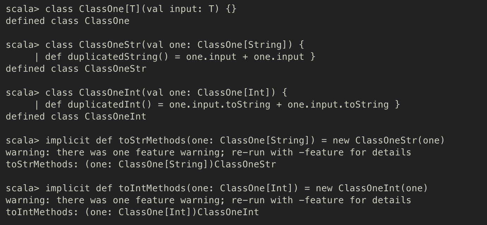
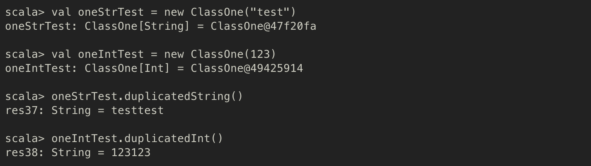

# 암시적 변환 (Implicit conversion)

다음과 같이 Scala 클래스를 하나 정의했다고 가정하자.
```Scala
class ClassOne[T](val input: T) { }
```
- `ClassOne` 클래스가 타입 매개변수를 가지므로 `input` 인수에 문자열이나 정수형, 또는 임의의 객체 등 다양한 타입을 전달할 수 있다.
- `input`이 **String**일 때는 ClassOne의 객체에 `duplicatedString()` 이라는 메서드가 정의되고
- `input`이 **Int**일 때는 ClassOne의 객체에 `duplicatedInt()` 라는 메서드가 정의되도록 만들어보자.
- 클래스를 두 개 추가로 정의하고, 각 클래스의 타입에 맞게 새로운 메서드를 선언한 뒤, ClassOne을 각 클래스로 변환하는 암시적 메서드를 두 개 정의하면 된다.

```Scala
class ClassOneStr(val one: ClassOne[String]) {
  def duplicatedString() = one.input + one.input
}
```

```Scala
class ClassOneInt(val one: ClassOne[Int]) {
  def duplicatedInt() = one.input.toString + one.input.toString
}
```

```Scala
implicit def toStrMethods(one: ClassOne[String]) = new ClassOneStr(one)
```

```Scala
implicit def toIntMethods(one: ClassOne[Int]) = new ClassOneInt(one)
```



- 컴파일러는 이제 `ClassOne[String]` 타입을 `ClassOneStr` 타입으로, `ClassOne[Int]` 타입은 `ClassOneInt` 타입으로 자동 변환한다. => **Implicit conversion**
- 따라서, 두 클래스의 메서드를 `ClassOne` 객체에서도 호출할 수 있게 된다.



- 그러나, `ClassOne[Int]` 타입 객체에서 `ClassOne[String]` 의 메소드를 선언하게 되면 암시적 변환이 일어나지 않으므로, 오류가 발생하게 된다.


- Spark의 RDD에서도 이런 암시적 변환이 일어나는데, RDD는 데이터의 타입에 따라 새로운 메서드를 자동으로 추가한다.
- Double 객체만 포함하는 RDD는 `org.apache.spark.rdd.DoubleRDDFunctions` 클래스의 객체로 자동 변환되어 doubleRDD 함수를 추가로 제공한다!
