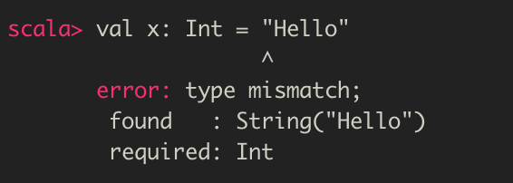
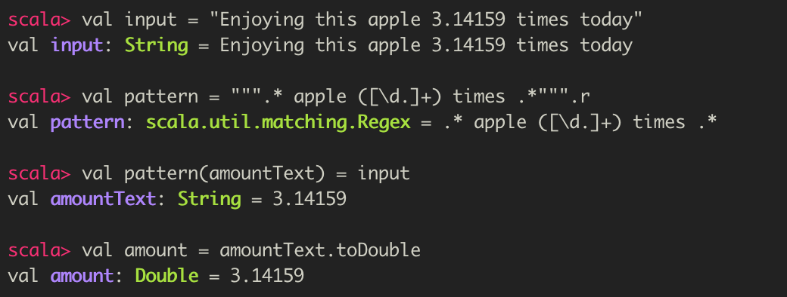

# 러닝 스칼라 - Ch2 데이터로 작업하기 : 리터럴, 값, 변수, 타입

  스칼라의 핵심인 데이터와 변수 타입을 알아보자. 먼저, 리터럴 (literal), 값(value), 변수 (variable), 타입(type) 의 정의부터 알아보자. 

### 1. 리터럴 (Literal)

- 숫자 5, 문자 A, 텍스트 'Hello World' 처럼 소스 코드에 바로 등장하는 데이터

### 2. 값 (Value)

- 불변의 타입을 갖는 저장 단위
- 값이 정의될 때 데이터가 할당될 수 있지만, 절대 재할당될 수는 없다
- immutable

### 3. 변수 (Variable)

- 가변의 타입을 갖는 저장 단위
- 정의 시 데이터를 할당할 수 있으며, 언제라도 데이터를 재할당 할 수 있다
- mutable

### 4. 타입 (Type)

- 작업하는 데이터의 종류
- 데이터의 정의 또는 분류를 의미함
- 스칼라의 모든 데이터는 특정 타입에 대응하며, 모든 스칼라 타입은 그 데이터를 처리하는 메소드를 갖는 클래스로 정의됨s

  스칼라에서 값과 변수에 저장된 데이터를 더 이상 사용하지 않으면 자바 가상 머신의 가비지 컬렉션 (garbage collection) 이 자동으로 할당을 취소함


# 스칼라의 값

- `val` 을 이용

```scala
val <이름>: <타입> = <리터럴>
```

타입이 Int인 이름 x를 만들고, 여기에 리터럴 숫자 5를 할당해보자

```scala
val x: Int = 5
```


다음은 이름 x를 사용해보자

```scala
x * 2
x / 5
```


위의 각 세개의 입력줄은 유효한 스칼라 구문으로, 정수값을 반환한다. 각 경우마다 값을 반환하므로, REPL은 그 값과 타입을 반복하고, res0을 시작으로 순차적으로 번호가 매겨진 유일한 이름의 값을 할당한다. 이 res값은 명시적으로 정의한 다른 값들과 마찬가지로 사용할 수 있다.

```scala
res0 * res1
```


- 위처럼, res0 와 res1을 곱하면 그 결과로 50이 반환되고, 새로운 값 res3에 저장된다.

### 스칼라의 변수

- 값과 다르게, 변수는 변경할 수 있고, 새로운 값을 재할당 할 수도 있다
- `var` 을 이용하여 정의한다

```scala
var <이름>: <타입> = <리터럴>
```


```scala
var a: Double = 2.72
```


- 부동 소수점 숫자인 Double 타입을 가지는 변수 a를 정의
- a는 변수이므로 여기에 다른 값을 재할당 할 수 있다


## 1. 값 (value)

- 불변의, 타입을 갖는 스토리지 단위
- 관례적으로 데이터를 저장하는 기본적인 방법
- `val` 키워드를 사용하여 새로운 값을 정의

```scala
val <식별자>[: <타입>] = <데이터>
```

- 값은 이름과 할당된 데이터 모두 필요하지만, 명시적 타입이 있어야 하는 것은 아님
- 타입이 지정되지 않았다면, 스칼라 컴파일러는 할당된 데이터를 기반으로 **타입 추론(type inference)** 을 하게된다


- 값 할당을 기반으로 그 타입을 추론하는 것이 가능한 상황이면, 값 정의에서 타입을 빼도 됨

- 스칼라 컴파일러는 할당된 값을 보고 그 값의 타입을 알아차리게 됨 => 타입 추론 (type inference)
  - 값을 타입 없이 정의하더라도, 타입이 없는 것은 아니며, 마치 타입을 지정하여 정의한 것처럼 적절한 타입을 할당함


- 타입을 지정하지 않은 예시


  값은 결국 타입이 명시적으로 기술되었을 때와 동일한 타입 (Int, String, Char)을 갖는다. 스칼라의 타입 추론을 사용하면 명시적으로 값의 타입을 작성할 필요가 없기에 코드를 작성할 때 유용하다. 그러나, 늘 코드의 가독성을 떨어뜨리지 않는 선에서 사용해야 함을 잊지말자.


  타입 추론이 데이터를 저장하는 데 사용할 데이터 타입을 추론하겠지만, 명시적인 타입을 대체하지는 않는다는 것에 주의하자. 초기값과 호환되지 않는 타입으로 값을 정의하면, 컴파일 에러가 발생한다.



- 위의 오류 메시지는 Int 타입은 String을 저장하는 데 사용할 수 없음을 알려주고 있다.


## 2. 변수 (variable)

> 변수 (variable)
>
> - 값을 저장하고 그 값을 가져올 수 있도록 할당되거나 예약된 메모리 공간에 대응하는 유일한 식별자
> - 메모리 공간이 예약되어 있는 도안에는 새로운 값을 계속 할당할 수 있다
> - 메모리 공간의 내용은 동적이며, 가변적 (variable)

- 동적이며, 변경 가능하고, 재할당 가능

  스칼라에서는 관례적으로 변수보다 값을 선호한다. 그 이유는 바로, 값을 사용하면 소스 코드가 안정적이며 예측 할 수 있기 때문이다. 값을 정의해두면, 다른 어떤 코드에서 접근하더라도 같은 값을 유지한다. 값은 변경되지 않기 때문에 디버깅하기 더 쉽다. 또한, 애플리케이션 수명 기간에 사용할 수 있거나 동시 또는 멀티 스레드 코드에서 접근 가능한 데이터도 작업하는 경우, 변하지 않는 값은 가변 데이터보다 더 안정적이며 에러가 발생할 가능성도 작다.

  변수는 임시 데이터를 저장하거나, 루프 내에서의 로컬 변수 같이 변수가 더 적합한 경우 사용한다. 스칼라에서 변수는 `var` 키워드를 사용한다.

```scala
var <식별자>[: <타입>] = <데이터>
```

- 변수도 명시적 타입 없이 정의할 수 있다. 타입이 지정되지 않았다면, 스칼라 컴파일러는 변수에 할당할 올바른 타입을 결정하기 위해 타입 추론을 사용한다. 하지만, 값과 달리 변수는 아무때나 새로운 데이터를 재할당할 수 있다.


  변수에 재할당이 가능하지만, 지정된 타입을 바꿀 수는 없으므로, 호환되지 않는 다른 데이터 타입을 할당하면 컴파일러 에러가 발생한다


하지만, 호환되는 데이터 타입으로 할당 시, 정상적으로 동작하는 것을 확인할 수 있다.


## 3. 명명

  스칼라 이름에는 문자, 숫자, 그리고 다양한 특수 연산자 (operator) 기호를 사용할 수 있다. 따라서, 좀 더 표현력 있는 코드를 작성할 수 있도록 더 긴 이름 대신 표준 수학 연산자와 상수를 사용할 수 있다.

스칼라에서 대괄호는 타입 매개변수화에 사용하도록 예약되어 있으며, 마침표는 객체 (인스턴스화된 타입)의 필드와 메소드에 접근하기 위해 예약되어 있다.

  스칼라에서 유효한 식별자를 만들기 위해 문자, 숫자, 기호를 조합하는 규칙은 아래와 같다.

1. 하나의 문자 다음에는 아무것도 없거나, 하나 이상의 문자 또는 숫자가 뒤따라온다.
2. 하나의 문자 뒤에는 아무것도 없거나, 하나 이상의 문자와 숫자가 뒤따르며, 그 뒤에는 언더스코어 (_)를 덧붙일 수 있고, 그 다음에 하나 이상의 문자와 숫자 또는 연산 기호가 뒤따른다
3. 하나 또는 그 이상의 연산자 기호
4. 하나 또는 그 이상의 문자를 한 쌍의 역인용 부호 (backquote, `)로 둘러싼다


- 특수문자 `&` 는 유효한 스칼라 식별자다
- 변수명 `50cent` 는 유효하지 않은데, 이름은 숫자로 시작할 수 없기 때문이다 
- 변수명 `a.b` 는 유효하지 않은데, 마침표는 연산자 기호가 아니기 때문이다
- 3을 backquote와 함께 사용하면 문제가 해결된다

  스칼라에서 값과 변수명은 관례상 camelCase를 사용한다.


## 4.타입

  스칼라에는 값과 변수를 정의할 때 사용하는 숫자 타입과 숫자가 아닌 타입이 있다. 이 핵심 타입은 객체 및 컬렉션을 포함하여 다른 모든 타입의 기본 요소가 되며, 그 자체도 자신의 데이터에 동작하는 메소드와 연산자를 갖는 객체가 된다. 스칼라에는 원시 데이터 타입의 개념이 없다. 자바 가상 머신은 원시 정수 타입인 int와 정수 클래스 Integer를 지원하는 반면, 스칼라는 정수 클래스인 Int만 지원한다.

### 4-1. 숫자형 데이터 타입 (Numeric Data Type)

- 핵심 숫자형 데이터 타입

| 이름   | 설명                  | 크기  | 최솟값 | 최댓값   |
| ------ | --------------------- | ----- | ------ | -------- |
| Byte   | 부호 있는 정수        | 1Byte | -128   | +127     |
| Short  | 부호 있는 정수        | 2Byte | -32768 | 32767    |
| Int    | 부호 있는 정수        | 4Byte | -2^31  | 2^31 - 1 |
| Long   | 부호 있는 정수        | 8Byte | -2^63  | 2^63 - 1 |
| Float  | 부호 있는 부동 소수점 | 4Byte | n/a    | n/a      |
| Double | 부호 있는 부동 소수점 | 8Byte | n/a    | n/a      |

  스칼라는 타입 순위에 기반하여 한 타입의 숫자를 자동으로 다른 타입으로 전환해준다. Byte 타입이 최하위에 있어 다른 모든 타입으로 전환될 수 있다.

아래 예제는 서로 다른 타입의 값을 생성하고 자동으로 그보다 높은 순위의 타입으로 전환하는 예제이다.


- b와 s의 값은 더 높은 순위를 갖는 새로운 값에 할당되며, 자동으로 더 높은 순위로 전환된다

  > 핵심 JVM 타입의 wrapper다. JVM 타입을 감싸는 것은 스칼라와 자바가 상호작용이 가능하게 하며, 스칼라가 모든 자바 라이브러리를 사용할 수 있게 해준다.

  스칼라에서는 높은 순위의 데이터 타입이 더 낮은 순위의 타입으로 자동 전환되는 것을 허용하지 않는다. 그 이유는 바로 데이터 손실이 일어날 수 있으므로이다.


- 높은 순위의 타입에서 더 낮은 순위의 타입으로 자동 전환 시 에러가 발생함을 알 수 있다.
- `to<Type>` 메소드를 이용하여 수동으로 타입 전환을 할 수도 있다. 하위 순위의 타입으로 전환함으로써 데이터를 잃을 수도 있겠지만, 해당 데이터가 더 낮은 순위의 데이터 타입과 호환이 가능하다는 점을 알고 있을 때는 유용하다. 아래 예시를 보자


- Long 값은 `toInt` 메소드를 이용하여 안전하게 Int 타입으로 전환할 수 있다. 그 데이터가 Int의 저장 공간 범위 내에 있기 때문이다

  명시적 타입의 대안으로 리터럴 타입을 위한 스칼라 표기법을 사용하여 리터럴 데이터의 타입을 직접 지정할 수 있다. 리터럴의 타입을 지정하는 전체 표기법은 아래와 같다.

| 리터럴 | 타입   | 설명                                                |
| ------ | ------ | --------------------------------------------------- |
| 5      | Int    | 접두사/접미사 없는 정수 리터럴은 기본적으로 Int이다 |
| 0x0f   | Int    | 접두사 '0x'는 16진수 표기법을 의미한다              |
| 5l     | Long   | 접미사 'l'은 Long 타입을 의미한다                   |
| 5.0    | Double | 접두사/접미사 없는 소수 리터럴은 기본 Double형이다  |
| 5f     | Float  | 'f' 접미사는 Float 타입을 나타낸다                  |
| 5d     | Double | 'd' 접미사는 Double 타입을 나타낸다                 |


## 5. 문자열

  스칼라의 String은 자바의 String을 기반으로 하며, 여러 줄 리터럴 (multiline literal)과 문자열 보간(interpolation) 같은 고유의 특징을 추가했다.


숫자 타입과 마찬가지로, String 타입은 수학 연산자의 사용을 지원한다. 스칼라에서, 두 개의 String 값이 같은지 비교하기 위해서는 등호 연산자 (==) 을 사용한다. 주의할 것은 자바에서는 객체 참조가 같은지 검사하지만, **스칼라에서는 실제 두 값이 같은지를 검사**한다는 점이다.


  여러 줄의 String은 큰따옴표 세 개를 이용하여 생성한다. 여러 줄의 문자열은 리터럴이며, 따라서 특수 문자의 시작을 나타내는 역슬래시를 인지하지 못한다. 


#### 문자열 보간

  문자열 추가를 이용하여 다른 값을 기반으로 String을 만들어보자


  값 또는 변수를 String 내에 결합시키는 보다 직접적인 방식은 외부 값과 변수명을 인식하고 해석하는 특수모드인 문자열 보간 (String interpolation)을 사용하는 것이다. 스칼라에서 문자열 보간은 문자열의 첫 큰따옴표 전에 접두사 `s` 를 추가하여 표기한다. 그런 다음, 달러 기호 `$` 를 이용하여 외부 데이터에 대한 참조임을 표시한다.


  문자열 보간의 또 다른 포맷은 printf 표기법을 사용하는 것으로, 문자 개수를 세거나 소수점 표기 같은 데이터 서식을 제어하고자 할 때 매우 유용하게 사용한다. printf 표기법에서는 접두사를 'f'로 바꾸고, 참조 바로 뒤에 printf 표기법을 써준다.


  printf 표기법은 참조 읽기를 다소 어렵게 하지만, 출력을 근본적으로 제어할 수 있다는 장점을 가진다.


#### 정규 표현식

> 정규 표현식 (Regular Expression)
>
> - 검색 패턴을 나타내는 문자와 구두점으로 이루어진 문자열
> - 스칼라의 정규 표현식 포맷은 자바 클래스 `java.util.regex.Pattern` 에 기반한다

##### 정규 표현식 연산

| 이름         | 예시                                                 | 설명                                                 |
| ------------ | ---------------------------------------------------- | ---------------------------------------------------- |
| matches      | "Froggy went a' corting" matches ".*courting"        | 정규 표현식이 전체 문자열과 맞으면 참(true)을 반환함 |
| replaceAll   | "milk, tea, muck" replaceAll ("m[^] +k", "coffee")   | 일치하는 문자열을 모두 치환 텍스트로 치환함          |
| replaceFirst | "milk, tea, muck" replaceFirst ("m[^] +k", "coffee") | 첫 번째로 일치하는 문자열을 치환 텍스트로 치환함     |

  정규 표현식의 고급 처리 기법을 위해서는 r 연산자를 호출해서 문자열을 정규 표현식 타입으로 전환하면 된다. 

  이는 캡처 그룹을 지원하는 것과 함께 추가적인 검색 / 치환 연산을 처리할 수 있는 Regex 인스턴스를 반환한다. 

> 캡처 그룹 (capture group)
>
> - 정규 표현식 패턴을 기반으로 주어진 문자열에서 항목을 선택하고 이를 로컬 값으로 전환할 수 있게 해준다.
> - 패턴은 최소 하나의 괄호로 정의된 캡처 그룹을 포함해야만 하며, 입력값은 값을 반환할 최소 하나의 캡처된 패턴을 포함해야 한다.


##### 정규 표현식으로 값 캡처하기

```scala
val <정규 표현식 값>(<식별자>) = <입력 문자열>
```



1. 캡처 그룹은 단어 apple과 times 사이에 있는 일련의 숫자와 점으로 이루어진 문자열이다. 여기서는 정규 표현식을 얻기 위해 StringOps의 r메소드를 사용했다
2. 전체 정규 표현식 타입은 `scala.util.matching.Regex` 또는 `util.matching.Regex` 이다.
3. 포맷은 확실히 다소 특이하다. 캡처 그룹 매치를 포함하는 새로운 값의 이름인 `amountText` 는 val 식별자 뒤에 바로 따라나오지 않는다.
4. 텍스트 형태의 숫자를 Double로 전화하여 숫자 값을 얻는다.


## 6. 스칼라 타입의 개요

  숫자, 문자열 외 스칼라 핵심 타입에 대해 알아보자. 모든 스칼라 타입은 숫자에서 문자열 그리고 컬렉션에 이르기까지 타입 계층 구조의 일부로 존재한다. 개발자가 정의한 모든 클래스 또한 자동으로 이 계층구조에 속하게 된다.

아래 그림은 스칼라 핵심(숫자형과 비숫자형) 타입의 계층 구조를 보여준다.


### 핵심 비숫자형 타입

| 이름    | 설명                                                  | 인스턴스화 |
| ------- | ----------------------------------------------------- | ---------- |
| Any     | 스칼라에서 모든 타입의 루트                           | 불가       |
| AnyVal  | 모든 값 타입의 루트                                   | 불가       |
| AnyRef  | 모든 참조(값이 아닌) 타입의 루트                      | 부가       |
| Nothing | 모든 타입의 하위 클래스                               | 불가       |
| Null    | 널(null) 값을 의미하는 모든 AnyRef 타입의 하위 클래스 | 불가       |
| Char    | 유니코드 문자                                         | 가능       |
| Boolean | 참 (true) 도는 거짓 (false)                           | 가능       |
| String  | 문자열(텍스트)                                        | 가능       |
| Unit    | 값이 없음을 나타냄                                    | 불가       |

#### Any

- 절대 루트
- 다른 모든 타입들은 이 루트의 두 자식 노드인 AnyVal, AnyRef의 자식

#### AnyVal - 값 타입 (value type)

- AnyVal을 확장한 타입은 데이터를 표현하는 데 사용하는 핵심 값들
- 숫자 타입, Char, Boolean, Unit
- 다른 타입들과 마찬가지로 접근됨
- 객체로 힙 메모리에 할당되거나 JVM 기본 값으로 스택에 지역적으로 할당됨

#### AnyRef

- 객체로 힙 메모리에만 할당됨
- 참조 타입

#### Nothing

- 다른 모든 타입의 서브타입
- 프로그램 흐름에 심각하게 영향을 줄 수 있는 연산에서 호환성 있는 반환값을 제공하기 위해 존재
- ex) 반환값과 함께 함수를 일찍 끝내는 return 키워드는 반환 타입 Nothing을 가지고 있어서 값을 초기화하는 도중에 사용할 수 있으며, 그 값의 타입에 영향을 주지 않음
- 타입으로만 사용하며, 인스턴스화 할 수 없음

#### Null

- 모든 AnyRef의 서브타입으로 키워드 null에 타입을 제공하기 위해 존재
- ex) String 변수는 언제라도 null에 할당될 수 있으며, 이 경우 그 변수는 메모리의 어떤 문자열 인스턴스도 가리키지 않음
- null은 String 타입과 호환되므로 null을 String 타입으로 선언된 변수에 할당 가능
  - null을 위한 타입을 정의한 것은 스칼라 구문이 예약된 키워드보다 실제 타입과 인스턴스를 사용하는 것을 더 좋아한다는 사실을 보여주는 예시

#### Char

- 숫자형 데이터 타입에도 등장할 수 있는 유일한 타입

- String 타입의 기본이 되는 타입으로, 단일 문자를 가지며 때로는 텍스트의 한 단위로 간주됨

- 기본적으로 다른 숫자와 양방향 전환이 가능

- 작은 따옴표로 작성됨

  

#### Boolean

- true와 false 값만을 가짐

  

- 다른 동적 언어들과 달리, 스칼라는 다른 타입을 Boolean 타입으로 자동 전환해주지 않음

- null이 아닌 문자열을 true로 평가하지 않으며, 숫자 0은 false와 다름

- 따라서, 값의 상태를 부울 타입으로 평가해야 한다면 명시적으로 비교해야 한다

  

#### Unit 

- 다른 핵심 타입 (숫자형과 비숫자형)과는 달리, 데이터 타입을 나타내는 대신 데이터가 없음을 나타냄

- void와 유사

- 어떤 것도 반환하지 않는 함수나 표현식의 반환 타입으로 쓰임

- ex) 일반 println 함수의 경우 아무것도 반환하지 않으므로 Unit 타입을 반환한다고 말할 수 있음

- Unit 리터럴

  - 빈 괄호 => 값이 없음
  - 가장 보편적인 용도 : 함수와 표현식 정의

  

### 타입 연산

  아래는 스칼라의 모든 타입에서 사용 가능한 연산을 보여준다. 모든 JVM 인스턴스에서는 toString과 hashCode 메소드가 필요하다.

### 공통 타입 연산

| 이름                 | 예제                      | 설명                                                         |
| -------------------- | ------------------------- | ------------------------------------------------------------ |
| asInstanceOf[<타입>] | 5.asInstanceOf[Long]      | 해당 값을 원하는 타입의 값으로 전환.<br />그 값이 새로운 타입과 호환되지 않으면 에러 발생 |
| getClass             | (7.0 / 5).getClass        | 해당 값의 타입 (즉, 클래스) 반환                             |
| isInstanceOf         | (5.0).isInstanceOf[Float] | 해당 값이 주어진 타입을 가지면 true 반환                     |
| hashCode             | "A".hashCode              | 해당 값의 해시 코드를 반환<br />해시 기반 컬렉션에서 유용함  |
| to<타입>             | 20.toByte<br />47.toFloat | 하나의 값을 호환되는 값으로 바꿔주는 전환 함수               |
| toString             | (3.0 / 4.0).toString      | 해당 값을 String으로 전환                                    |

> asInstanceOf는 가급적 피하는 것이 좋다 
>
> - asInstanceOf 연산은 값이 요청받은 타입으로 전환될 수 없으면 에러가 발생한다
> - 이 연산으로 런타임 에러가 발생하는 것을 피하기 위해서는 가능하다면 타입 지정된 전환 연산인 `toType` 을 사용하는 것이 좋다


  위에서 다룬 타입은 모두 단일 요소를 나타내는 스칼라 (scalar) 값이다. 다음은 스칼라 값의 보완책으로 둘 이상의 값을, 새로운 , 순서가 있는 단일 요소로 수집하는 Tuple 타입을 알아보자.


## Tuple

- 둘 이상의 값을 가지는 순서가 있는 컨테이너
- 이곳에 포함된 각각의 값은 서로 다른 타입을 가질 수 있다
- 값을 논리적으로 분류할 필요가 있고, 그렇게 분류한 값들을 하나의 응집된 단위로 표현하는데 유용함
- 그러나 리스트와 배열과는 달리 튜플의 요소들을 반복할 수 없다
- 튜플은 단지 하나 이상의 값을 담기 위한 컨테이너이다

### 튜플 생성

```scala
(<값 1>, <값 2>, [<값 3> ...] )
```

- Int, String, Boolean 값을 갖는 튜플


- 튜플의 각 항목은 1부터 시작하는 인덱스를 이용하여 접근할 수 있음

  

#### 두 개의 항목을 가지는 튜플을 생성하는 다른 형식 : 화살표 연산자 사용


튜플은 데이터를 구조화하는 일반적인 방법을 제공하며, 데이터 처리를 위해 개별 항목들을 모아둘 필요가 있을 때 유용하다.


## Reference

- 제이슨 스와츠, 『Learning Scala』, 제이펍(2017), p.9 ~ p.30

