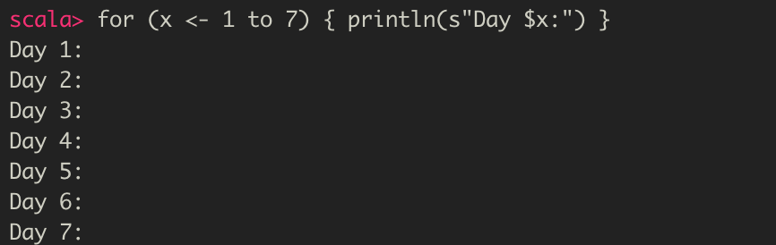
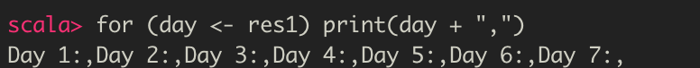
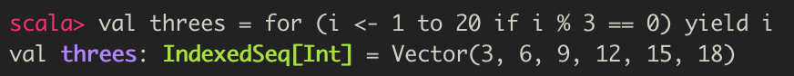
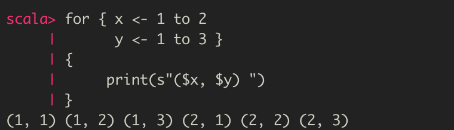
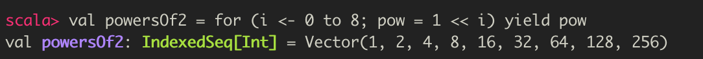
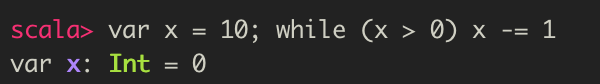
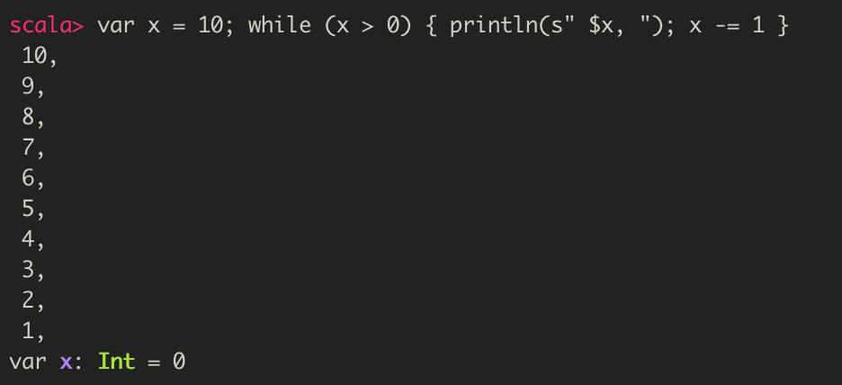
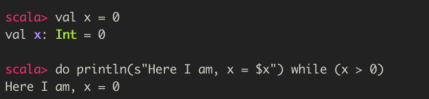

# 표현식과 조건문

  스칼라의 표현식, 문장, 조건문에 대해 알아보자.

# 1. 표현식 (expression)

- 실행 후 값을 반환하는 코드 단위

- 한 줄 이상의 코드를 중괄호 ({}) 로 묶으면 하나의 표현식으로 간주

  - 표현식 블록 (expression block)

- 변수와 같은 기존 데이터를 변경하는 대신 값을 반환할 수 있기 때문에 함수형 프로그래밍의 기반이 됨

- 새로운 데이터를 기존 변수 대신에 새로운 값에 저장하는 함수형 프로그래밍의 핵심 개념인 **불변의 데이터** 를 사용할 수 있게 함

  만약, 코드가 전부 값을 반환하는 표현식을 하나 이상 가지는 계층구조로 구성될 수 있다면, 불변의 데이터를 사용하는 것은 복잡하지 않다.

  표현식의 반환값은 다른 표현식에 전달되거나 값(value)에 저장될 것이다. 변수를 사용하는 방식에서 값을 사용하는 방식으로 옮겨갈 수록 함수와 표현식의 부작용은 줄어든다

  즉, 함수와 표현식은 제공한 입력값에 대해서만 동작하므로 반환값 외에 다른 데이터에는 영향을 주지 않는다


- 서로 다른 방식으로 구현되었지만 **동일한 결과**를 생성함
- 중요한 것은 표현식이 **반환하는 값**
  - 표현식에서는 **획득하고 사용할 수 있는 값을 반환**하는 것이 전부

##  1. 표현식으로 값과 변수 정의하기

- 값과 변수에 표현식의 반환값이 할당된다

### 표현식을 이용하여 값과 변수 정의하기

```scala
val <식별자>[: <타입>] = <표현식>
var <식별자>[: <타입>] = <표현식>
```

  표현식은 대부분의 스칼라 구문을 정의하는 데 좋은 기반이 될 수 있다

## 2. 표현식 블록

- 여러 표현식을 중괄호를 사용하여 하나로 묶어 단일 표현식 블록(experssion block)을 만들 수 있다
- 표현식은 자신만의 범위 (scope)를 가지며, 해당 표현식 블록에 국한된 값과 변수를 포함한다
- 그 블록의 마지막 표현식이 전체 블록의 반환값이 된다

  예시로, 블록으로 더 잘 동작할 두 개의 표현식을 한 줄로 작성해보자


위의 예시에서 우리가 관심을 가질 값은 `amount` 뿐이다. 이 표현식들을 결합하고, 그 블록에 `x` 값을 포함시킨 뒤, `amount` 값을 정의하여 이 블록의 반환값으로 사용해보자


  블록 마지막 표현식인 `x + 10` 은 블록의 반환값을 결정한다. 이전 예제에서는 `x` 값이 `amount`와 동일한 레벨에서 정의되었다면, 바로 위의 예제에서는 그 블록에 국한되어 정의되었다. 바로 위의 예제 코드는 `x` 를 사용하는 의도가 `amount` 를 정의하기 위한 것임이 분명해졌기에 더 깔끔하다고 할 수 있다.


- 표현식 블록은 필요한 만큼 여러 줄로 확장할 수 있다. 아래 예제를 보자


- 표현식 블록은 중첩이 가능하며, 표현식 블록의 각 레벨은 자신만의 고유 범위의 값과 변수를 가진다


## 3. 문장 (statement)

- 값을 반환하지 않는 표현식
- 문장의 반환 타입은 값이 없음을 나타내는 `Unit`
- 스칼라에서 보편적으로 사용되는 문장 : `println()`


  위의 값 정의는 어떤 것도 반환하지 않기 때문에 문장에 해당한다고 할 수 있다

- 문장 블록 (statement) 은 표현식 블록과는 다르게 값을 반환하지 않는다
- 문장 블록은 결과값이 없다
- 보편적으로, 기존 데이터를 수정하거나 그 애플리케이션 범위 밖을 변경하는 데 사용한다
  - ex) 콘솔에 쓰기, 데이터베이스 업데이트 하기, 외부 서버와 연결하기

# 2. If .. Else 표현식 블록

  If .. Else 조건식은 표현식이 참인지 거짓인지를 따져서 실행할 코드를 선택하는 고전적인 프로그래밍 구조다. 스칼라에서는 자바 `if .. else if .. else` 와는 다르게 공식적으로는 하나의 `if` 와 선택적인 `else` 블록만을 지원한다. `else if` 블록을 단일 구성체로 인식하지 않는다. 

  그렇다면, 어떻게 스칼라에서 `else if` 가 올바르게 동작할 수 있을까? 

 ⭐️ `if .. else ` 블록이 표현식 블록에 기반하고 있고, 표현식 블록은 쉽게 중첩될 수 있으며 따라서, `if .. else if .. else` 표현식은 `if .. else { if .. else}` 랑 동일하기 때문이다

논리적으로, `if.. else if .. else` 블록과 정확하게 일치하며, 스칼라 구문으로 두 번째 `if else`를 외부 `if .. else` 블록에 중첩된 표현식으로 인식한다.


## 1. If 표현식

```scala
if (<부울식>) <표현식>
```

> 부울식
>
> - true나 false를 반환하는 표현식

아래 예제는 부울식이 참일 때 안내문을 출력하는 간단한 형태의 if 블록이다


  당연히 부울식이 true이므로, println 이 실행된다

if 블록을 표현식으로 사용하면 조건부로 값을 반환하는 경우 문제가 되는데, 만약 부울식이 false를 반환하면 if 블록은 무엇을 반환하게 될까?


  위 예제에서 result 값은 타입이 지정되지 않았으므로, 컴파일러는 타입 추론을 통해 가장 적합한 타입을 결정한다. String이나 Unit 타입으로 반환될 수 있으므로, 컴파일러는 루트 클래스 `Any` 를 선택한다. 

`Any`가 `AnyRef` 의 자식 노드인 `String` 과 `AnyVal` 의 자식 노드인 `Unit` 을 아우르는 공통 클래스이기 때문이다.

## 2. If-Else 표현식

```
if (<부울식>) <표현식>
else <표현식>
```


  위 예제에서 x,y 값이 if와 else 표현식 전체를 이루는 것을 볼 수 있다. 결과값은 max에 할당되며, 두 표현식 모두 Int 타입을 반환하므로 max도 Int 타입임을 알 수 있다.

  스칼라는 왜 삼항 표현식을 사용하지 않을까? 스칼라에서는 if와 else 블록은 한 줄에 간결하게 맞아떨어지기 때문에 삼항 표현식이 실제로 필요없다.

  모든 것이 한 줄에 맞아 떨어진다면, if..else 표현식에서 표현식 블록 없이 단일 표현식을 사용하는 것이 좋다. 그러나, 한 줄에 맞아 떨어지지 않는다면, 가독성을 위해 표현식 블록을 사용하는 것이 좋다. else가 없는 if 표현식은 부작용을 일으키는 문장이 되는 경향이 있기에 **언제나 중괄호를 사용**해야 한다.

  if..else 블록은 조건부 로직을 작성하는 간단하고 보편적인 방식이다. 하지만 스칼라에서는 조건부 로직을 작성하는 좀 더 우아한 방법으로 **매치 표현식 (match expression)** 을 사용한다.


# 3. 매치 표현식 (Match expresssion)

  매치 표현식은 단일 입력 항목을 평가하여 처음으로 일치하는 (matched) 패턴이 실행되고, 그 값이 반환되는 C와 자바의 'switch'문과 유사하다. 스칼라의 매치 표현식은 자바의 switch문 처럼 기본으로 또는 와일드카드로 모두 잡아내는 (catch-all) 패턴을 지원한다. 반면에 매치 표현식은 0개 또는 단 하나의 패턴만 매칭할 수 있으므로, 여러 개의 패턴을 한 번에 순서대로 매칭하는 형태의 제어 이동 (fall-through)이 없다. 따라서 break문도 없다.

  전형적인 switch문은 값을 매칭하는 작업으로 제한되지만, 스칼라의 매치 표현식은 다양한 항목을 매칭할 수 있을 만큼 유연하게 쓸 수 있다. 매치 표현식의 기본 구문과 용도에 대해 알아보자.

### 매치 표현식 사용하기

```scala
<표현식> match {
	case <패턴 매치> => <표현식>
	[case ...]
}
```

> 스칼라에서 (=>) 화살표를 따라가는 다중 표현식을 지원하지만, 가독성이 떨어지는 이유로 권장하지는 않는다.
>
> case 블록에 다중 표현식이 있다면, 중괄호로 감싸서 표현식 블록으로 전환하는 것이 좋다


  위의 예제는 ``if .. else`` 예제와 달리 부울식을 먼저 처리하고, 그 결과를 true나 false에 매치한다


매치 표현식의 또 다른 예제로, 표현식의 입력값에 따라 값을 반환하는 것 이외에 추가적인 동작을 하는 예제를 보자


  case 블록 내부에 둘 수 있는 문장과 표현식 개수의 제약은 없지만, 마지막 표현식만 매치 표현식의 반환값으로 사용된다. 


여러 패턴을 하나로 결합하여 그 패턴 중 하나라도 일치하면 case 블록이 실행되는 **패턴 대안(pattern alternative)** 을 만들 수 있다.

### 패턴 대안

```scala
case <패턴 1> | <패턴 2> .. => <하나 이상의 표현식>
```

  패턴 대안은 여러 패턴에 대해 동일한 case 블록을 재상요함으로써 코드 중복을 방지한다. 아래 예제는 파이프 기호 (|) 를 사용하여 일곱 가지 패턴에 대한 매치 표현식을 두 가지 패턴으로 줄인 예제이다.


  만약, 입력 표현식에 일치하는 패턴을 못찾는 경우는 어떻게 될까? 패턴이 일치하지 않는 예제를 보자.


스칼라 컴파일러는 런타임 에러로 처리한다. 오류 타입인 `scala.MatchError` 는 매치 표현식이 입력값을 처리하는 데 실패했음을 가리킨다.

  매치 표현식을 방해하는 에러를 예방하려면 와일드카드 모두-일치 (wildcard match-all) 패턴을 사용하거나, 모든 가능한 입력 패턴을 포괄하는 패턴을 추가해야한다. 와일드카드 패턴은 가능한 모든 입력 패턴을 매치시킴으로써, `scala.MatchError` 가 발생하는 것을 방지한다.


## 1. 와일드카드로 매칭하기

  매치 표현식에서 사용할 수 있는 와일드카드 패턴에는 

1. 값 바인딩 (value binding)
2. 와일드카드 연산자 (underscore)

가 있다.

### 1. 값 바인딩

  값 바인딩을 이용하면 매치 표현식의 입력 패턴은 로컬 값에 바인딩 되어 case 블록의 본문 내에서 사용할 수 있다. 이 패턴은 바인딩되어 있는 값의 이름을 포함하고 있기에 매칭할 실제 패턴이 없으며, 따라서 값 바인딩은 어떤 입력값에도 일치하므로 와일드카드 패턴이 된다

```scala
case <식별자> => <하나 이상의 표현식>
```


값 `other` 는 case 블록이 유지되는 동안 정의되며, 매치 표현식의 입력값인 `message` 값이 할당된다.


### 2. 와일드카드 연산자

  와일드카드 패턴의 다른 형태로는 와일드카드 연산자, underscore 가 있다. 이 연산자는 밑줄 기호로 표시되며, 실행시간(런타임)에 표현식의 최종값이 들어갈 자리의 이름을 대신하여 자리 표시자 역할을 한다. 값 바인딩과 마찬가지로 매칭할 패턴을 제공하지 않기 때문에 어떤 입력값이라도 매칭되는 와일드카드 패턴이 된다.

```scala
case _ => <하나 이상의 표현식>
```

- 화살표 오른쪽에서 접근할 수 없다는 점이 중요하다
- case 블록에서 와일드카드의 값에 접근해야 한다면, 값 바인딩을 쓰거나, 매치 표현식의 입력값에 접근해야한다

아래 예시를 보자


예제에서 확인할 수 있듯이, case 블록 내에서 바인딩된 값처럼 접근할 수 없으므로, 매치 표현식의 입력값인 `message` 을 사용해야 한다.


## 2. 패턴 가드를 이용한 매칭

  패턴 가드 (pattern guard) 는 값 바인딩 패턴에 if 표현식을 추가하여 match 표현식에 조건부 로직을 섞어 쓸 수 있게 한다. 패턴 가드를 사용하게되면, 그 패턴은 if 표현식이 true를 반환할 때만 매칭된다.

```scala
case <패턴> if <부울식> => <하나 이상의 표현식>
```

  일반적인 if 표현식과 달리, 여기에서의 if 표현식은 부울식을 둘러싸는 괄호가 필요없다. 이 경우에는 화살표가 전체 명령문을 파싱하고 조건식의 부울식을 기술하는 작업을 대신하고 파싱을 단순화하기 때문이다.


아래 예제를 보자.


위 예제는 응답이 null이 아닌 것과 null인 것을 구별하는 패턴 가드를 사용하여 메시지를 출력하는 예제이다.


## 3. 패턴 변수를 이용한 타입 매칭

  매치 표현식에서 패턴 매칭을 하는 다른 방법은 바로 ㅇ비력 표현식의 타입을 매칭하는 것이다. 매칭된다면 패턴 변수는 입력값을 다른 타입의 값으로 전환할 수 있다.

```scala
case <identifier>: <type> => <하나 이상의 표현식>
```

  중요한 것은 패턴 변수를 명명하는데 반드시 소문자로 시작해야 한다는 것이다.

아래 예제를 보자


매치 표현식에 주어진 값이 Any 타입을 가지더라도 그 값이 가지고 있는 데이터가 Int로 생성되었다.

이렇게, 매치 표현식은 그 값에 주어진 타입 뿐만 아니라 그 값의 실제 타입을 기반으로 매칭할 수 있다.

그 결과, 예제의 x는 Any 타입이 주어졌어도 정수로 인식하게 된다.


# 4. 루프 (loop)

  루프란, 하나의 작업을 반복적으로 수행하는 것을 나타내는 용어로, 일정 범위의 데이터를 반복하거나 부울식이 false를 반환할 때까지 반복하는 것을 의미한다.

## 1. for-comprehension

- 일정 범위의 데이터를 반복하며, 반복할 때마다 표현식을 실행함
- 선택적으로 그 실행문의 반환값들을 컬렉션 (collection)으로 돌려줌
- 반복문 중첩, 필터링, 값 바인딩을 지원하는 등 커스터마이징이 매우 쉬움


### Range

- 시작과 끝을 나타내는 정수와 함께 `to` 또는 `until` 연산자를 이용하여 생성 가능

#### 1. to

- 끝을 나타내는 정수를 모두 포함하는 리스트 생성

#### 2. until

- 끝을 나타내는 정수를 포함하지 않는 리스트 생성


### 숫자 범위를 정의하는 구문

```scala
<시작 정수값> [to|until] <끝 정수값> [by increment]
```


### for 루프의 기본 정의

```scala
for (<식별자> <- <반복자>) [yield] [<표현식>]
```

- **`yield`**
  - 선택 사항으로, 
  - 호출된 모든 표현식의 반환 값이 컬렉션으로 반환됨
- yield가 없이 표현식이 기술되어 있다면, 그 표현식이 호출되기는 하지만, 그 반환값에는 접근 불가능하게 됨


  for 루프는 괄호나 중괄호를 사용하여 정의 가능하다.

- 한 줄에 iterator를 사용하는지 아니면 단일 iterator를 사용하는지에 따름

- 괄호로 작성된 for 루프 사용하면, 마지막 반복자 전에 위치하는 각 반복자 줄은 세미콜론으로 마쳐야 함
- 중괄호로 작성한 for 루프를 사용하면, 반복자 줄 뒤에 세미콜론을 붙일지 여부는 선택임


#### 1부터 7까지 요일을 반복하고 각 요일의 헤더를 출력하는 예제



- `yield` 가 없으므로, 루프 표현식은 문장이다
  - 중괄호는 그 안에 단일 명령문만 있어서, 사실 생략해도 된다


- 만약, 리턴값이 `Day X:` 메시지의 컬렉션을 원하는 것이라면?

  - `yield` 를 이용해보자

  

- 반복되는 문장을 바로 출력하는 대신, 각 메시지를 반환하는 표현식으로 전환하고, yield 키워드를 추가하여 전체 루프를 결과 컬렉션으로 반환하는 표현식으로 전환하면 된다

- res1 은 문자열로 이루어진 색인된 시퀀스 타입인 `IndexedSeq[String]` 타입이며, IndexedSeq의 구현 중 하나인 `Vector` 에 할당되었다

  - 스칼라는 객체 지향 다형성을 지원하기 때문에 `IndexedSeq` 의 서브 타입인 `Vector` 는 `IndexedSeq` 타입을 가지는 값에 할당될 수 있다

- `res1` 컬렉션은 다른 for 루프에서 반복자로 사용할 수 있다


#### 각 메시지를 생성하고 출력하는 시퀀스를 반복하는 for 루프 예제




## 2. 반복자 가드 (iterator guard) / filter

- 반복자에 if 표현식을 추가하여, 반복자 가드를 사용한다
- 반복자 가드 사용 시, if 표현식이 **true**를 반환할 때만 반복을 수행한다

```scala
for (<identifier> <- <iterator> if <Boolean expression>) ... 
```


#### 반복자 가드를 사용하여 3의 배수로 이루어진 컬렉션을 만드는 예제



####반복자와 반복자 가드를 구분한 예제


## 3. 중첩된 반복자 (nested iterator)



- for 루프에 추가된 부가적인 반복자

- 전체 반복 횟수를 자신의 반복 횟수만큼 반복한다

  

- 기존의 루프에 부가적인 반복자 추가 == 별도의 중첩된 루프를 작성하는 것과 동일하므로 중첩된 반복자

- 전체 반복 횟수는 모든 반복자 횟수의 곱셈


## 4. 값 바인딩 (value binding)

- for 루프에서 일반적인 전략 : 현행 반복을 기반으로하는 표현식 블록 내에 임시 값 또는 변수를 정의하는 것
  - 스칼라에서는 for 루프 정의에서 값 바인딩(value binding)을 하는 것
  - 동일한 작업을 하지만, 표현식 블록의 크기와 복잡도를 최소화할 수 있다는 장점


### for 루프에서 값 바인딩

```scala
for (<식별자> <- <반복자>; <식별자> = <표현식>) ...
```


#### 0 부터 8까지 2의 거듭 제곱 값을 계산하는 예제



- 연산자에 들어갈 인수는 2의 곱셈을 효과적으로 하기 위해 1비트씩 왼쪽으로 이동하는 횟수
- 각 연산의 결과는 `pow`에 바인딩
- `pow` 
  - 루프에서 반복할 때마다 정의되고 할당됨
  - for 루프에 의해 생성되므로 결과는 각 반복마다 산출된 `pow` 값의 컬렉션
  - 

## 6. While 과 Do / While 루프

  스칼라는 부울식이 `false` 를 반환할 때까지 문장을 반복하는 while과 do/while을 지원한다. 그러나, for 루프에 비해 표현식이 아니며 값을 생성 (**yield**) 하는 데는 사용할 수 없어서 잘 사용하지 않는다.

### While 루프 구문

```scala
while (<부울식>) 표현식
```


#### 하나의 숫자를 그 숫자가 0보다 크지 않을 때까지 하나씩 감소시키는 while 루프 예제






#### do/while 루프 예제



- `do-while` 루프는 부울식을 처음 평가하기 전에 **문장이 한 번 실행**된다
- 예제에서 부울식은 거짓을 반환하지만, 문장이 한 번 실행된 후에야 부울식을 검사하게된다


- while, do/while 루프를 사용하는 경우가 있을까?
  - 소켓에서 더 읽어 들일 내용이 없을 때까지 반복하는 경우에 사용한다


## Reference

- 제이슨 스와츠, 『Learning Scala』, 제이펍(2017), p.31 ~ p.49
