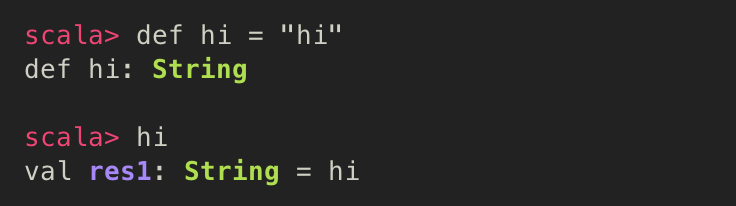
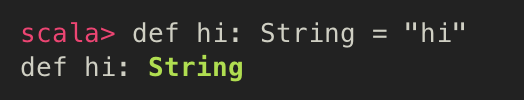
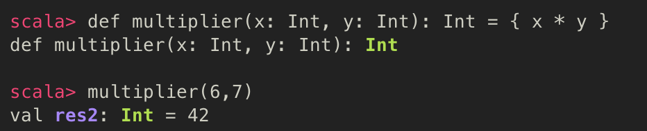
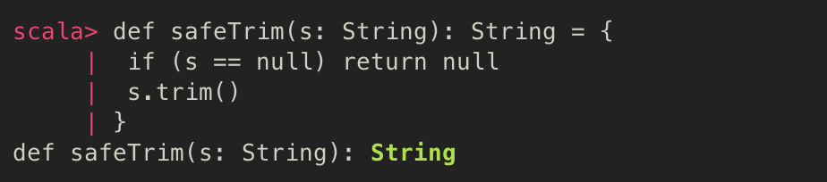
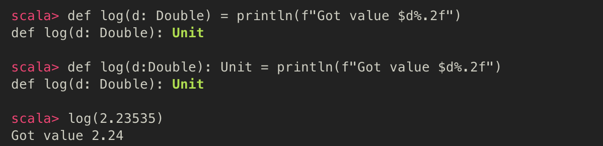
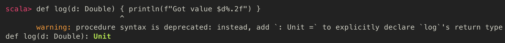
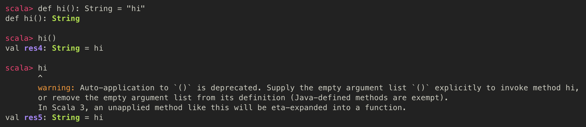
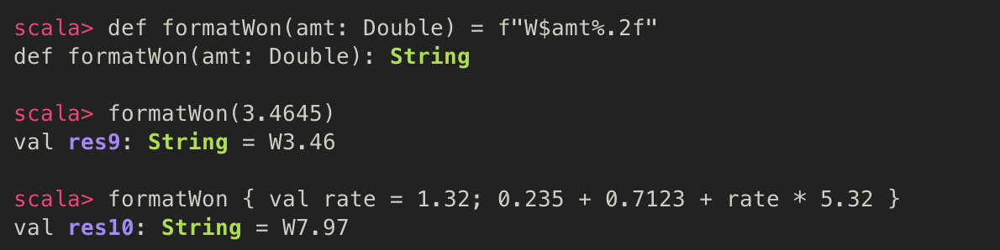

# [4] 러닝 스칼라

  스칼라의 함수에 대해 알아보자. 일반적으로, 함수는 재사용 가능한 로직의 핵심 구성 요소다. 함수형 프로그래밍 언어인 스칼라는 재사용성이 아주 높고, 구성력이 좋은 함수를 지원한다.


## 1. Function (함수)

- 이름을 가진, 재활용 가능한 표현식
- 매개변수화 할 수도 있고, 값을 반환할 수도 있지만 두 항목 모두 필수는 아님
  - 재사용성과 구성력을 최대화 해줌 (가독성이 높고, 안정적인 애플리케이션을 작성할 수 있도록 함)

### 표준 함수형 프로그래밍의 방법론 - 순수 함수를 이용하자

#### 순수 함수

- 입력 매개변수로만 유도되는 계산

##### 특징

- 하나 또는 그 이상의 입력 매개변수를 가진다
- 입력 매개변수만을 가지고 계산을 수행한다
- 값을 반환한다
- 동일 입력에 대해 항상 같은 값을 반환한다
- 함수 외부의 어떤 데이터도 사용하거나 영향을 주지 않는다
- 함수 외부 데이터에 영향을 받지 않는다
  - 그래서, 더 안정적이다
    - 상태 정보를 저장하지 않으며, 파일, DB, 소켓, 전역변수 등 다른 공유 데이터와 같은 외부 데이터에 관계없이 독립적이기 때문

### 스칼라에서의 함수 작성법

### 1. 입력 값이 없는 함수

```scala
def <식별자> = <표현식>
```

- 가장 기본적인 형태
- 스칼라 함수는 표현식을 감싼 이름이 부여된 wrapper라고 생각하면 된다

##### 아래와 같은 경우에 주로 이용

- 현행 데이터의 포맷을 만들 때
- 새로운 데이터를 위한 원격 서비스를 확인할 때 
- 고정값을 반환하는 함수가 필요할 때



- 함수의 반환 타입은 명시적으로 정의되지 않더라도 존재함


### 2. 반환 타입을 지정한 함수

```scala
def <식별자>: <타입> = <표현식>
```

- 가독성을 높이기 위해 명시적 타입으로 반환타입을 지정할 수 있음




### 3. 입력 값 및 반환 타입을 지정한 함수

```scala
def <식별자>(<식별자: <타입>[, ...]): <타입> = <표현식>
```

- 표현식 또는 표현식 블록으로 구성
- 마지막 줄이 표현식의 반환 값이 됨 (return 문을 명시하지 않아도 됨)
- 함수 표현식 블록의 마지막에 이르기 전에 종료하고 값을 반환해야 하는 경우 (ex) 입력값이 유효하지 않거나 비정상적인 경우)
  - **return** 문을 이용해서 함수의 반환값을 명시적으로 지정하고 함수를 종료



##### 함수의 조기종료를 위해 return 문이 추가된 함수 예제




## 2. Procedure (프로시저)

- 반환 값을 가지지 않는 함수
- ex) println()
- 스칼라에서 문장으로 끝나는 명시적인 반환 타입이 없는 단순 함수
  - 스칼라 컴파일러는 함수의 반환 타입을 값이 없는 **Unit** 으로 추론

#### 로깅 프로시저 (묵시적 반환 타입과 명시적 반환 타입으로 정의)



> deprecated 된 프로시저 정의 방식
>
> - Unit 반환 타입과 프로시저 본문 앞의 등호를 사용하지 않고 정의
>
>   
>
> - 함수 호출자에게 실제로 반환될 반환값을 기대하면서 뜻하지 않게 반환 값을 가지고 프로시저를 작성하는 경우가 많아서 사용하지 않는 것이 좋음
>
>   - 위의 프로시저 구문은 어떠한 반환 값이 오더라도 폐기되기 때문


## 3. 빈 괄호를 가지는 함수

- 입력 매개변수가 없는 함수를 정의하고 호출할 때 이용
- 함수와 값을 분명하게 구분해주기에 더 좋은 방식

```scala
def <식별자>()[: <타입>] = <표현식>
```



- 호출 시, 빈 괄호를 사용하거나 빈 괄호를 빼고 호출 할 수도 있지만, 
  - 빈 괄호를 빼고 호출하는 것은 좋은 방법은 아니다
  - 또한, **괄호 없이 정의된 함수**를 **괄호를 사용하여 호출하는 것은 안된다**
    - 괄호 없이 함수를 호출하는 것을 함수로 그 함수의 반환 값을 호출하는 것과 혼동하는 것을 방지하기 위해

> 부작용이 있는 함수는 괄호를 사용해야 한다
>
> - 입력 매개변수가 없는 함수가 함수 범위 밖의 데이터를 변경한다면 (부작용을 가진다면), 
> - 빈 괄호를 사용하여 정의되어야 함
>   - ex) 콘솔에 메시지를 쓰는 입력 매개변수가 없는 함수는 빈 괄호와 함께 정의되어야 함


## 4. 표현식 블록을 이용한 함수 호출

- 단일 매개변수를 사용하여 함수를 호출할 때, 괄호 안에 값을 넣는 대신 중괄호 안에 표현식 블록을 사용해서 매개변수를 전달 가능하다
  - 함수 호출을 위해 표현식 블록을 사용하면, 연산 또는 다른 행위를 처리하고 그 블록의 반환값으로 함수를 호출 가능

```scala
<함수 식별자> <표현식 블록>
```

- 함수에 계산된 값을 전달해야 하는 경우는 함수 호출을 위해 표현식 블록을 이용하는 것이 낫다
  - 값을 계산하고 해당 값을 함수에 전달할 지역 값에 저장하는 대신, 표현식 블록 내에서 연산을 할 수 있다
  - 표현식 블록은 함수를 호출하기 전에 평가되며, 그 블록의 반환값은 함수 인수로 사용된다



- 함수에 전달하고자 하는 값이 이미 계산되었다면, 함수 매개변수를 지정하기 위해 괄호를 사용하는 것이 자연스러움
- 그러나, 함수에서 계산식만 유일하게 사용하고 코드를 다른 사람들이 읽을 수 있도록 유지할 수 있다면, 
  - **표현식 블록을 이용하여 함수를 호출**하는 것이 좋다


## 5. Recursion function (재귀 함수)

- 자기 자신을 호출하는 함수
- 특정 타입의 매개변수 또는 함수 호출이 무한 루프에 빠지는 것을 피하고자 검사할 외부 조건과 함께 호출
- 데이터 구조 또는 계산을 가변적인 데이터를 사용하지 않고 반복하는 방법을 제공하기에 보편적으로 이용
  - 각 함수 호출 시 함수 매개변수를 지정하기 위해 **stack** 을 사용하기 때문에 가변적인 데이터를 사용하지 않을 수 있음


- 재귀 함수 사용의 주의점 : **Stack Overflow**
  - 재귀 함수를 **너무 많이 호출**하여 할당된 스택 공간을 모두 소진하는 경우 발생
- Stack Overflow를 방지하기 위해, 스칼라 컴파일러는 재귀적 호출이 추가적인 스택 공간을 사용하지 않도록
- **Tail-recursion (꼬리 재귀)** 를 사용하여 일부 재귀 함수를 최적화


## Reference

- 제이슨 스와츠, 『Learning Scala』, 제이펍(2017), p.9 ~ p.30